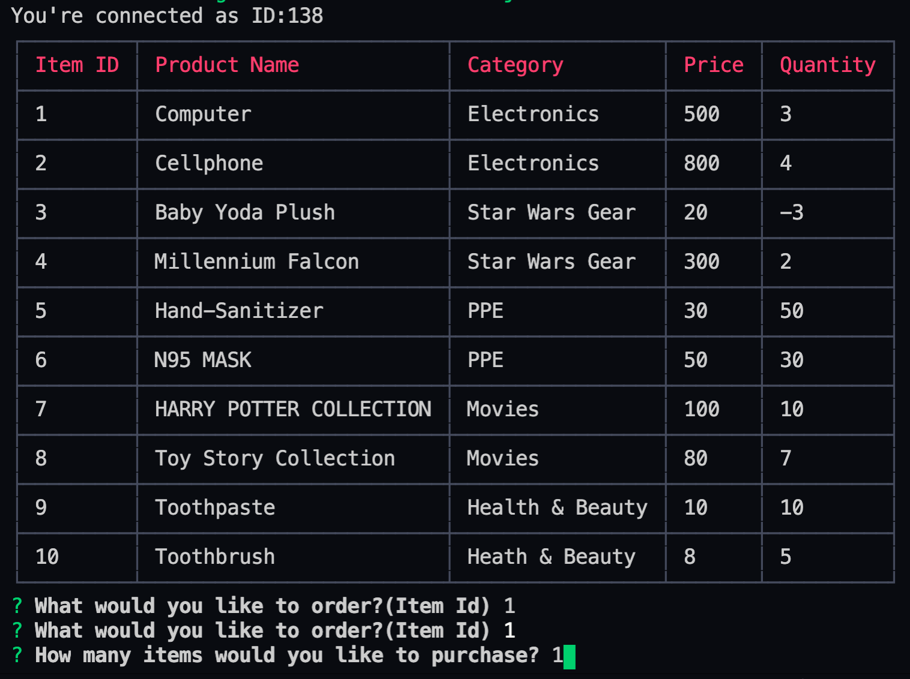

# Bamazon

## Activity
    This activity was created to appear as an Amazon storefront for mock customers. The customer would
    select an item from a table of merchandise and proceed to order the quantity that they wish. 

    If the stock quantity meets the demand, it'll proceed by giving you the 'TOTAL' and a 'THANK YOU' message.

    However, if the stock quantity does NOT meet the demand, it'll display an error message to the customer and apologize for the lack of the product they wished to purchase. 

## NPM Installs 
    CLI-TABLE
    INQUIRER
    mySql 

## ScreenShots 

    